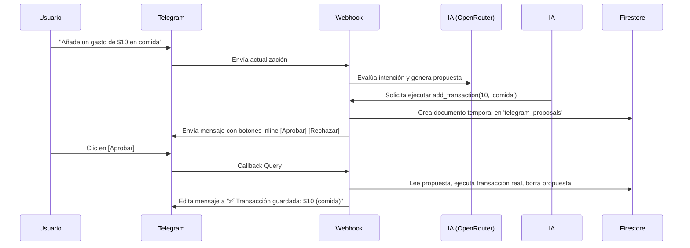

# Documentación del Módulo de Inteligencia Artificial (Luisda Bot)

Este documento recopila toda la arquitectura, optimizaciones de tokens y control de costos que hemos implementado para el funcionamiento del asistente de Inteligencia Artificial en la aplicación web y el bot de Telegram.

---

## 1. Control de Costos y Límite Diario (Economía y Prevención)
Para evitar consumos accidentales de la API de OpenRouter (que usa modelos premium como GPT-4o-mini), se diseñó un rastreador de consumo dinámico:
* **Límite Diario Estricto:** Se implementó un validador (`_costTracker.js`) que bloquea las solicitudes a la IA una vez superado el presupuesto diario fijado (por defecto **$0.50** o configurable).
* **Alertas Tempranas:** Si el consumo diario se acerca al límite, el bot notifica al usuario y detiene temporalmente el procesamiento de lenguaje natural.
* **Monitoreo desde la Web / Telegram:**
  * Comando `/creditos` en Telegram: Consulta en tiempo real el dinero exacto gastado del día en curso.
  * Panel Web: Muestra estadísticas de tokens y costos acumulados en el chat.

---

## 2. Optimización de Llamadas (Single LLM Call)
Originalmente, las arquitecturas basadas en agentes y herramientas de OpenRouter suelen realizar múltiples llamadas de ida y vuelta (round-trips) para invocar una función y luego procesar el resultado. Implementamos:
* **Ejecución Local de Lecturas:** Cuando el bot necesita consultar datos (por ejemplo, transacciones, diario, recordatorios o syllabus de materias), resuelve la herramienta directamente en el servidor.
* **Función `summarizeToolResult`:** Pasa la consulta inicial del usuario, la llamada a la herramienta elegida y su resultado local a OpenRouter en una sola y única llamada de retorno. Esto reduce la latencia a la mitad y disminuye el uso de tokens drásticamente.

---

## 3. Historial de Chats y Gestión de Sesiones (Persistencia Estilo Gemini)
Implementamos una estructura de historial robusta en la base de datos Firestore:
* **Conversaciones Independientes:** Permite al usuario cerrar la conversación actual e iniciar un nuevo chat limpio en cualquier momento.
* **Restauración de Conversaciones Históricas:** Muestra una barra lateral de chats pasados. Al hacer clic en un chat anterior, se cargan y restauran todos sus mensajes cronológicamente.
* **Borrado Selectivo:** Permite eliminar conversaciones específicas de la barra lateral para mantener la privacidad del historial.
* **Prevención de Truncamiento:** El tamaño de los mensajes enviados en el contexto a la IA está limitado y depurado para evitar exceder el límite de tokens (context window).

---

## 4. Bandeja de Aprobaciones de Telegram (Seguridad de Escritura)
Para evitar que la IA modifique o borre registros de forma destructiva o errónea mediante comandos por voz/texto en Telegram, creamos un sistema de aprobación humana (Approval Inbox):

---

## 5. Cerebro del Asistente y Perfil de Usuario Configurable
Desde el panel de configuración de la app web, el usuario puede personalizar las variables clave que se inyectan dinámicamente en el prompt del sistema:
* **Identidad y Tono:** Selección de nombre (`Luisda Bot` por defecto) y tono (cercano, motivador, directo, gracioso o formal).
* **Perfil del Dueño:** Información estática (como el nombre completo *Luisdavid Gerardo Colina Villegas*, Cédula *V-24766381* y cuentas bancarias) que le permite a la IA conocer a su usuario a la perfección sin tener que preguntarlo constantemente.
* **Base de Conocimiento Dinámica (`bot_knowledge`):** Colección editable desde la web donde se pueden guardar notas generales (ej. datos de estudio, temarios, etc.) que la IA leerá automáticamente cuando sea necesario mediante consultas semánticas.

---

## 6. Recordatorios Inteligentes y QStash
La integración de recordatorios automáticos por hora (tanto exactos como recurrentes de diario) requirió eludir los límites de tiempo de ejecución de las Serverless Functions de Vercel Hobby (10 segundos):
* **Integración con QStash (Upstash):** Los recordatorios programados por la IA o los comandos `/recordar` delegan la cola de mensajería a QStash.
* **Ejecución Asíncrona:** Cuando llega la hora exacta, QStash despierta la API del webhook en `/api/send-exact-reminder` de forma asíncrona, enviando el mensaje a Telegram sin retrasos y de forma robusta.
* **Resiliencia (Fallback local):** Si la base de datos del temario (`syllabus`) está vacía, el bot tiene un fallback inteligente para leer directamente el archivo `PLAN_ESTUDIO.md` de la biblioteca, asegurando que el bot siempre pueda asistir con los temas de estudio de la UCV.
